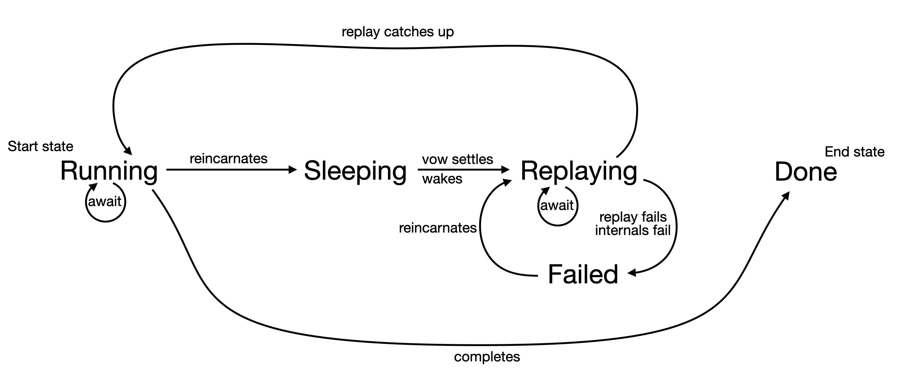

# Async Flow States

 A prepared guest async function is like an exoClass (and is internally implemented by an exoClass). It is primarily represented by the host wrapper function that `asyncFlow` returns. Each call on that wrapper function creates an activation of that guest function. A guest activation is like an exoClass instances (and is internally implemented as an instance of the function's internal exoClass). The state diagram shows the lifecycle of an guest function activation

- ***active current***. This is the state they're born into as of the first invocation that creates and starts the activation.

- ***sleeping***. If in incarnation i1 the activation was paused waiting on a vow to settle, and in incarnation i2 the vow has not yet settled, then *ideally* we can leave the durable replay log and other state in durable storage. We should not need to reactivate it until that vow actually settles.

- ***active replay***. Once a vow it was `await`ing on in a previous incarnation does settle, we need to restore the guest activation to a heap manifestation as a JS `async` and set it in motion replaying from its durable log. Once it finishes replaying from the log, it has caught up and transitions to ***active current***, reaching the `await` at which it slept. If the promise it is `await`ing corresponds to a vow that's now settled, it continues as ***active current*** from that point.

- ***replay failure***. If during the ***active replay*** state the guest activation fails to exactly reproduce its previously logged behavior, it becomes inactive as ***replay failure*** associated with a diagnostic explaining how the replay failed, so it can be repaired by another future upgrade. As of the next incarnation, the failure status is cleared and all these go into ***active replay*** in order to retry replaying the from the log.

- ***done***. If the promise the guest activation returned settles, we assume that the job of the guest activation is done. It then goes into a durably done state, dropping all its bookkeeping beyond just remembering that it is done. The replay logs and membrane state are all dropped.
